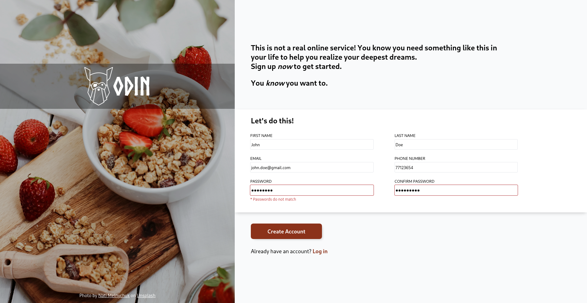
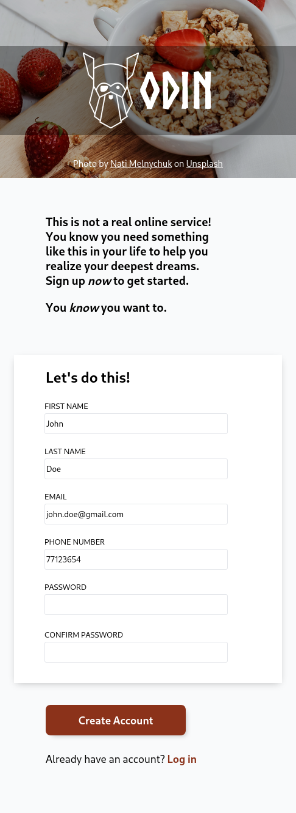

# Sign-up Form

A sign-up form created as part of The Odin Project's [curriculum](https://www.theodinproject.com/lessons/node-path-intermediate-html-and-css-sign-up-form).

## About The Project

#### Path - [Full Stack JavaScript](https://www.theodinproject.com/paths/full-stack-javascript)

#### Course - [Intermediate HTML and CSS](https://www.theodinproject.com/paths/full-stack-javascript/courses/intermediate-html-and-css)

### Description

This project is intended to give you a chance to flex some of the new items you’ve been absorbing over the past few lessons. This time it’s a sign-up form for an imaginary service.

## Showcase

### Desktop

### Mobile

## Live Demo

👉 **Preview:** https://emuel-vassallo.github.io/odin-sign-up-form/

## Built With

- HTML
- CSS
- JavaScript

## What I Learned

- Using a local font
- Using javascript to check if passwords in a form are equal
- Using pseudo-classes to add content to an element
- Using relative and absolute positioning

## Credits

- [Photo](https://unsplash.com/photos/1_-EHQhkI_4) by [Nati Melnychuk](https://unsplash.com/@natinati)
